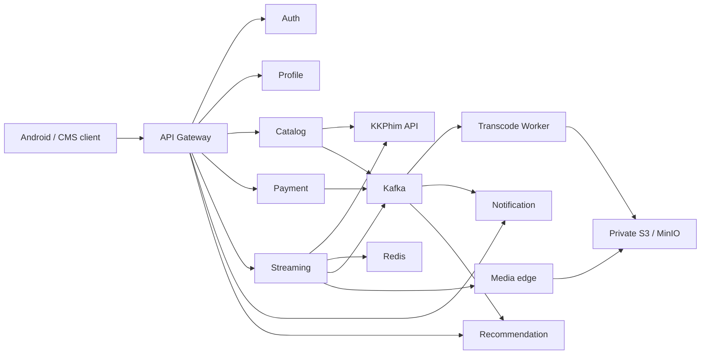

# MovieApp Backend

Backend cho ứng dụng xem phim, phục vụ đồng thời catalog từ KKPhim và nội dung do hệ thống tự upload/phân phối. Workspace hiện hoàn thành các giai đoạn G0–G10: tài khoản, profile, catalog hai nguồn, entitlement mock, phiên phát/progress, upload–transcode HLS, search/Home, notification/recommendation, nghiệm thu local và artifact staging.

Hệ thống chưa được deploy staging hoặc production. Chưa có registry được cấp quyền, hostname/TLS/ingress, CDN/object storage staging và secret target.

## Tài liệu

- [Thiết kế sản phẩm Android](document/thiet-ke-app-xem-phim.md)
- [Thiết kế backend chi tiết](document/backend-chi-tiet.md)
- [Lộ trình và bằng chứng theo giai đoạn](document/todo-prompt-backend.md)
- [Tích hợp KKPhim](document/kkphim-api.md)
- [Hợp đồng kiểm tra G9](document/g9-api-contract.md)

## Kiến trúc



Mỗi service có database PostgreSQL riêng. Kafka dùng outbox/inbox để giao sự kiện bền vững; Redis giữ playback lease; OpenSearch phục vụ tìm kiếm catalog. Nguồn KKPhim chỉ được resolve khi tạo phiên phát và URL phát không được lưu bền vững. Nội dung owned đi qua upload presigned, FFmpeg HLS và media-edge.

## Yêu cầu local

- Node.js `24.21.0` theo [.nvmrc](.nvmrc) và npm 10 trở lên.
- Docker Engine và Docker Compose v2.
- FFmpeg/FFprobe để chạy E2E owned-media. CI cài FFmpeg trước khi chạy suite này.

Không commit `.env`, `.env.staging`, `.secrets` hoặc thư mục `secrets`.

## Khởi động môi trường local

```sh
cp .env.example .env
npm ci
npm run dev:keys
npm run infra:up
npm run infra:media
npm run build
```

`infra:up` khởi động PostgreSQL, Redis và Kafka, sau đó bootstrap database, role và topic có thể chạy lặp lại. `infra:media` bật OpenSearch, MinIO, media-edge và tạo hai bucket private. Trên Linux, OpenSearch cần `vm.max_map_count=262144`.

Chạy các service ở terminal riêng khi phát triển thủ công:

```sh
npm run start:auth
npm run start:gateway
npm run start:profile
npm run start:catalog
npm run start:payment
npm run start:streaming
npm run start:worker
npm run start:notification
npm run start:recommendation
```

Lần đầu hoặc sau khi có migration mới, chạy từng database migration theo thứ tự:

```sh
npm run migration:run
npm run migration:profile:run
npm run migration:catalog:run
npm run migration:payment:run
npm run migration:streaming:run
npm run migration:worker:run
npm run migration:notification:run
npm run migration:recommendation:run
```

Tắt môi trường local nhưng giữ dữ liệu volume:

```sh
npm run infra:down
```

## Kiểm thử

Kiểm tra tĩnh và smoke nền tảng:

```sh
npm run lint
npm run typecheck
npm run build
npm test
```

Suite tích hợp đầy đủ G9 cần core + media Compose và kiểm tra catalog, KKPhim fixture, payment, playback hai nguồn, upload/transcode HLS, Home và notification/recommendation:

```sh
npm run test:e2e
```

Các E2E theo capability cũng có thể chạy riêng: `smoke:profile-ci`, `smoke:catalog-ci`, `smoke:payment-ci`, `smoke:streaming-ci`, `smoke:owned-media-ci`, `smoke:g7-ci` và `smoke:g8-ci`.

`npm run smoke:kkphim-live` gọi KKPhim thật để kiểm tra adapter; không dùng nó làm test CI vì dữ liệu/provider bên ngoài có thể thay đổi.

## Image, migration và artifact staging

Build image local theo SHA của commit hiện tại:

```sh
npm run images:build
```

Image runtime dùng user `node` và entrypoint allow-list theo service. `transcode-worker` dùng target có FFmpeg; target `migrations` chạy tuần tự migration của tám database. Các kiểm tra artifact G10:

```sh
npm run smoke:g10-artifacts
npm run smoke:g10-images
npm run smoke:g10-migrations
npm run smoke:g10-restore
```

- `smoke:g10-images` kiểm tra user/entrypoint, FFmpeg và health của Auth/media-edge image.
- `smoke:g10-migrations` áp dụng migration image vào tám database tạm từ schema trống rồi xóa chúng.
- `smoke:g10-restore` diễn tập dump/restore PostgreSQL và restore object MinIO byte-for-byte.

[docker-compose.staging.yml](docker-compose.staging.yml) và [.env.staging.example](.env.staging.example) là artifact chuẩn bị staging, không chứa secret thật. Migration phải chạy đúng một lần trước rollout; ứng dụng không tự chạy migration khi khởi động replica. Payment staging đặt `PAYMENT_MOCK_ENABLED=false`; private JWT key chỉ mount cho Auth.

Khi đã có target staging, tạo `.env.staging` từ template, đặt image tag SHA và secret file/secret store thực tế, rồi kiểm tra cấu hình trước khi rollout:

```sh
docker compose --env-file .env.staging -f docker-compose.staging.yml config --quiet
docker compose --env-file .env.staging -f docker-compose.staging.yml --profile migration run --rm migrations
```

Sau đó mới rollout image SHA theo quy trình hạ tầng đã được cấp. Không xem các lệnh trên là deploy thành công nếu chưa có target thật.

## CI

[GitHub Actions workflow](.github/workflows/ci.yml) xác định phạm vi thay đổi. Thay đổi app chạy backend checks; thay đổi shared library, lockfile, root config, workflow hoặc script chạy toàn workspace vì dự án chưa có dependency graph chính thức. Pull request chỉ chạy checks. Push vào `main` hoặc tag trusted mới publish image lên GHCR với tag `sha-${github.sha}`.
