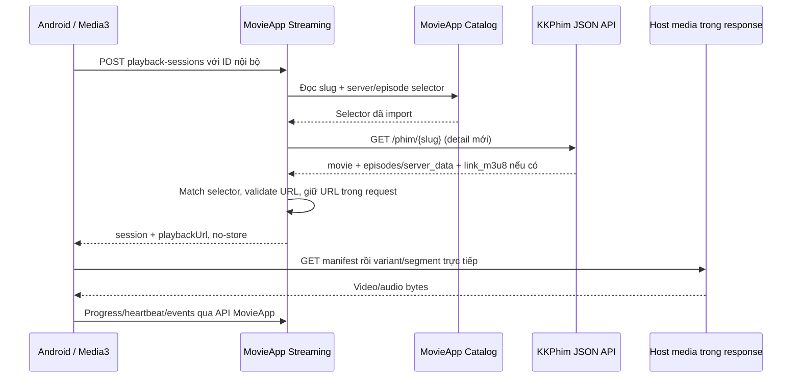

# Tài liệu tích hợp API KKPhim

Ngày đối chiếu tài liệu gốc: **2026-09-12**. Đây là tài liệu tham khảo cho backend MovieApp. G3 đã triển khai client metadata tương thích với fixture legacy/v1 và E2E offline; chưa thực hiện smoke live với KKPhim nên endpoint/schema drift và playback/CDN compatibility vẫn cần xác minh. Nguồn chuẩn endpoint/response là [Tài liệu API KKPhim](https://kkphim.com/api-document). Schema, API nội bộ và luồng xử lý thuộc [thiết kế backend chi tiết](backend-chi-tiet.md).

## 1. Tổng quan

| Thuộc tính | Theo tài liệu KKPhim |
|---|---|
| Base URL | `https://phimapi.com` |
| Phương thức/định dạng | GET, JSON, UTF-8 |
| Xác thực | Tài liệu được đọc không nêu API key cho các endpoint dưới đây |
| Phân trang | `page`; một số endpoint có `limit`; envelope và tên trường pagination khác nhau giữa legacy/v1 |

> Tài liệu không công bố cam kết SLA, quota/rate limit, hạn URL phát, DRM hay tải offline. Không xem việc không thấy giới hạn trong tài liệu là bằng chứng các giới hạn đó không tồn tại. Adapter cần timeout, concurrency cap, retry hữu hạn và xử lý schema drift.

## 2. Endpoint

Các endpoint sau được liệt kê trong tài liệu gốc. `{...}` là path parameter; encode giá trị khi tạo URL.

### 2.1. Phim mới, trang chủ và danh sách

| Mục đích | Endpoint | Ghi chú |
|---|---|---|
| Phim mới cập nhật (legacy) | `GET /danh-sach/phim-moi-cap-nhat?page={page}` | Trả `status`, `items`, `pathImage`, `pagination`; mặc định trang 1. Tài liệu cũng liệt kê biến thể hậu tố `-v2`, `-v3` có bổ sung dữ liệu ảnh/TMDB/IMDB. |
| Trang chủ KKPhim | `GET /v1/api/home?page={page}` | Phim cập nhật trong ngày; envelope v1. |
| Phim mới (v1) | `GET /v1/api/danh-sach?page={page}` | Có wrapper `data`, `params`, `pagination`; hỗ trợ bộ lọc chung. |
| Danh sách theo loại (legacy) | `GET /danh-sach/{type}?page={page}` | `phim-le`, `phim-bo`, `hoat-hinh`, `tv-shows`, `phim-chieu-rap`. |
| Danh sách theo loại (v1) | `GET /v1/api/danh-sach/{type}` | `phim-le`, `phim-bo`, `hoat-hinh`, `tv-shows`; bộ lọc chung. |

Bộ lọc chung được tài liệu mô tả cho nhóm endpoint v1:

| Tham số | Ý nghĩa |
|---|---|
| `page` | Trang hiện tại, mặc định 1 |
| `limit` | Số phim/trang; tìm kiếm nêu mặc định 10, tối đa 64. Không giả định mọi endpoint danh sách áp dụng giống nhau. |
| `category` | Slug thể loại, ví dụ `hanh-dong` |
| `country` | Slug quốc gia, ví dụ `han-quoc` |
| `year` | Năm hoặc dải năm, ví dụ `2024` hoặc `2014,2024` |
| `sort_field` | `modified.time`, `_id`, `year`; mặc định `modified.time` |
| `sort_type` | `desc` hoặc `asc`; mặc định `desc` |
| `sort_lang` | `vietsub`, `thuyet-minh`, `long-tieng` |

Legacy thường trả `items` trực tiếp cùng `pagination`; v1 thường đặt danh sách ở `data.items` và thông tin trang trong `data.params.pagination`. Phải có parser riêng theo endpoint/shape, không dùng chung giả định envelope.

### 2.2. Chi tiết phim và server/tập

| Mục đích | Endpoint | Ghi chú |
|---|---|---|
| Chi tiết theo slug (legacy) | `GET /phim/{slug}` | `movie` và `episodes` ở cấp gốc. Endpoint được thiết kế backend dùng khi resolve. |
| Chi tiết theo ID KKPhim | `GET /phim/id/{id}` | Tra cứu bằng `_id` của KKPhim. |
| Chi tiết theo TMDB | `GET /tmdb/{type}/{id}` | `type=movie|tv`; response mẫu gồm movie và episodes. Chỉ dùng tra cứu hỗ trợ, không tự gộp record. |
| Chi tiết theo IMDB | `GET /imdb/title/{id}` | Tra cứu theo ID IMDB. |
| Chi tiết theo slug (v1) | `GET /v1/api/phim/{slug}` | Phim nằm trong `data.item`; wrapper có `data.params`, `seoOnPage`, `breadCrumb`. |

Các trường thường gặp của đối tượng phim:

| Trường nguồn | Ý nghĩa / xử lý |
|---|---|
| `_id` | ID provider; lưu dạng chuỗi làm `external_id`, khóa import ổn định. |
| `slug` | Alias tra cứu có thể đổi; lưu `external_slug`, không dùng làm ID lịch sử. |
| `name`, `origin_name`, `alternative_names` | Tên hiển thị, tên gốc, tên khác; có thể thiếu/rỗng. |
| `content`, `status`, `year`, `time` | Mô tả HTML cần sanitize; trạng thái/năm; thời lượng thường là text, parse lỗi thì null. |
| `type`, `episode_current`, `episode_total` | Nhãn loại/trạng thái tập; không suy ra `movie/series` chỉ từ nhãn như `hoathinh`. |
| `thumb_url`, `poster_url` | Có thể là URL tuyệt đối hoặc tương đối. Xử lý theo `pathImage` hoặc base ảnh của response tương ứng. |
| `category[]`, `country[]` | Phần tử thường có `name`, `slug`, `id`; dùng slug để mapping danh mục khi thích hợp. |
| `tmdb`, `imdb` | ID/điểm ngoài có thể null hoặc 0; không thay ID KKPhim. |
| `actor[]`, `director[]` | Metadata có thể xuất hiện ở response chi tiết; không bảo đảm đồng nhất giữa endpoint/version. |
| `modified.time` | Dấu thời gian tham khảo để làm mới metadata; không giả định luôn đổi khi URL phát đổi. |

Chi tiết legacy đặt các nhóm server trong `episodes[]`; v1 đặt các tập ở `data.item.episodes[]`. Mỗi phần tử thường mô tả server (`server_name`, có thể `is_ai`) và danh sách `server_data[]`. Mỗi lựa chọn trong `server_data` thường có `name`, `slug`, `filename`, `link_m3u8`, `link_embed`.

Các trường URL được thể hiện trong response mẫu, không có cam kết phim nào cũng có đủ HLS/embed. `episodes[]` chứa nhóm server; `server_data[]` chứa lựa chọn tập/server. Không coi tên server là season, không chọn phần tử đầu tiên để đoán tập. Metadata `quality` không chứng minh HLS có rendition tương ứng.

### 2.3. Tìm kiếm

| Endpoint | Tham số | Response |
|---|---|---|
| `GET /v1/api/tim-kiem?keyword={keyword}` | `keyword` bắt buộc; `page`, `limit` và bộ lọc chung | v1: `status`, `message`, `data.items`, `data.params.pagination` |

Tài liệu nói tìm theo tên tiếng Việt và tên gốc. Endpoint này phục vụ admin khám phá/nhập phim. Public search MovieApp vẫn dựa trên catalog đã import để giữ ID, phân trang, favorites và history thống nhất.

### 2.4. Thể loại, quốc gia, năm, thông tin mở rộng

| Mục đích | Endpoint | Ghi chú |
|---|---|---|
| Danh sách thể loại | `GET /the-loai` hoặc `GET /v1/api/the-loai` | Tên và slug. |
| Phim theo thể loại | `GET /v1/api/the-loai/{slug}` | Phân trang và bộ lọc chung. |
| Danh sách quốc gia | `GET /quoc-gia` hoặc `GET /v1/api/quoc-gia` | Tên và slug. |
| Phim theo quốc gia | `GET /v1/api/quoc-gia/{slug}` | Bộ lọc chung. |
| Danh sách năm | `GET /nam-phat-hanh` hoặc `GET /v1/api/nam` | Danh sách năm. |
| Phim theo năm | `GET /v1/api/nam/{year}` | Bộ lọc chung. |
| Ảnh theo phim | `GET /v1/api/phim/{slug}/images` | Thông tin profile/path ảnh. |
| Diễn viên/đạo diễn/nhân sự | `GET /v1/api/phim/{slug}/peoples` | Dữ liệu mở rộng, không cần cho playback MVP. |
| Từ khóa | `GET /v1/api/phim/{slug}/keywords` | Dữ liệu mở rộng. |

## 3. Dạng phản hồi

### Legacy — danh sách

```json
{
  "status": true,
  "items": [{ "_id": "...", "name": "...", "slug": "..." }],
  "pathImage": "https://phimapi.com/uploads/movies/",
  "pagination": {
    "totalItems": 100,
    "totalItemsPerPage": 24,
    "currentPage": 1,
    "totalPages": 5
  }
}
```

### Legacy — chi tiết

```json
{
  "status": true,
  "msg": "",
  "movie": { "_id": "...", "slug": "...", "name": "..." },
  "episodes": [
    {
      "server_name": "Vietsub",
      "server_data": [
        {
          "name": "Full",
          "slug": "full",
          "link_m3u8": "https://media.example/manifest.m3u8",
          "link_embed": "https://player.example/embed"
        }
      ]
    }
  ]
}
```

### V1 — danh sách/tìm kiếm

```json
{
  "status": "success",
  "message": "",
  "data": {
    "items": [{ "_id": "...", "name": "...", "slug": "..." }],
    "params": {
      "pagination": {
        "totalItems": 100,
        "totalItemsPerPage": 24,
        "currentPage": 1,
        "pageRanges": 5
      }
    }
  }
}
```

### V1 — chi tiết

```json
{
  "status": "success",
  "message": "",
  "data": {
    "params": { "slug": "...", "includeUnpublished": false },
    "item": {
      "_id": "...",
      "name": "...",
      "slug": "...",
      "episodes": []
    }
  }
}
```

> JSON đã rút gọn để minh họa envelope và vị trí field, không phải JSON Schema đầy đủ. Giá trị URL media trong tài liệu này là ví dụ minh họa.

Parser phải nhận diện legacy/v1 theo endpoint, kiểm tra trạng thái và cấu trúc tối thiểu, chấp nhận field nullable/thiếu, và trả lỗi mapping có ngữ cảnh. Không ép mọi response qua một DTO trước khi biết phiên bản.

## 4. Ánh xạ sang backend MovieApp

| Dữ liệu KKPhim | Mô hình MovieApp | Quy tắc |
|---|---|---|
| `_id` | `content_sources.external_id` | Unique theo provider + external ID; import lặp giữ cùng record. |
| `slug` | `external_slug`/alias | Có thể thay đổi; collision cần xử lý, không gắn nhầm phim. |
| Metadata `movie` | `movies` | UUID nội bộ ổn định; có thể gắn cả source `owned` và `third_party`. |
| Phim lẻ | Một `playable_items(kind='movie')` | ID không phụ thuộc source/server/URL. |
| Một tập | `playable_items(kind='episode')` | Season/episode label/order; nếu mơ hồ cần admin mapping. |
| Server và selector tập | `source_items` | Lưu server key/label và selector ngoài tối thiểu. |
| `link_m3u8`/`link_embed` | Kết quả resolver trong request | Không ghi DB, cache metadata, event, log, OpenSearch hay idempotency record. |
| `pathImage`, poster/thumb | URL ảnh metadata | Ghép relative URL theo base ảnh phù hợp, không dùng base API mù quáng. |
| `category[]`, `country[]`, `year` | Genres/countries/year nội bộ | Upsert/mapping theo slug khi phù hợp. |
| `modified.time` | `external_updated_at` | Gợi ý refresh metadata; không bỏ lịch refresh selector. |

Chiến lược đồng bộ: discovery giới hạn trang và lưu checkpoint; import idempotent theo `_id`; slug là alias. Admin có thể gắn nguồn vào `movieId` đã tồn tại. Không auto-merge theo tên gần giống; TMDB/IMDB chỉ là tín hiệu hỗ trợ. Archive thủ công không bị sync mở lại. Public catalog/search dùng dữ liệu local đã import, không trộn live search với local pagination.

## 5. Luồng resolve playback



KKPhim JSON API trả metadata và URL tham chiếu. Host media có thể ở domain khác. Android tải HLS trực tiếp theo manifest, backend không proxy bytes video. Tài liệu không mô tả expiry của URL hay toàn bộ redirect/segment behavior; cần kiểm thử resolver và Android media client bằng fixture lẫn smoke thật trước khi cam kết playback ổn định.

Nếu chỉ có `link_embed`, MVP hiện tại trả `PLAYBACK_MODE_UNSUPPORTED`; không tự mở WebView. Nếu không match chính xác tập/server, báo lỗi rõ ràng thay vì chọn một tập khác.

## 6. Quy tắc adapter

- **HTTP:** GET JSON UTF-8; timeout, giới hạn concurrency và tổng thời gian. Retry hữu hạn cho lỗi phù hợp, jitter; tôn trọng `Retry-After` nếu response cung cấp.
- **Pagination:** đọc page/total từ đúng envelope; đặt `maxPages` và checkpoint. Lặp/thiếu trang không đồng nghĩa xóa phim.
- **Fixture/schema:** legacy và v1; phim lẻ/series; `Full`; nhiều server; field thiếu/null; URL thiếu; slug đổi; relative image; lỗi/empty response.
- **Matching:** ưu tiên `_id`; slug là alias. Không merge tự động theo tên/ảnh. Các server cùng tập chia sẻ playableId, mỗi lựa chọn có sourceItemId riêng.
- **URL an toàn:** backend chỉ gọi base API cấu hình; validate HTTPS/domain, redirect và địa chỉ mạng riêng cho request backend thực hiện. Android tự kiểm tra redirect/URI con của manifest; kiểm tra backend không bảo vệ request trực tiếp từ thiết bị.
- **URL phát:** chỉ giữ trong memory resolver/response no-store. Không log/cache/database/event/OpenSearch. Redact query string/credential nếu có.
- **Phục hồi:** lỗi nguồn có retryAfter/circuit breaker/half-open, không đánh dấu lỗi vĩnh viễn chỉ từ một lần timeout.
- **Thông tin chưa công bố:** tài liệu đã đọc không nêu quota, SLA, API key, hợp đồng expiry URL. Cần recheck khi bắt đầu tích hợp; không suy ra là không có giới hạn.

Các timeout, retry, concurrency, cache và endpoint MovieApp nằm trong mục tích hợp KKPhim của [thiết kế backend](backend-chi-tiet.md). Đó là cấu hình khởi điểm của dự án, không phải quota do KKPhim công bố.

## 7. Việc xác nhận khi triển khai

- Lưu fixture đã làm sạch cho endpoint/version được sử dụng; CI không phụ thuộc Internet.
- Kiểm tra mã HTTP/shape khi slug không tồn tại, timeout, throttling và schema drift.
- Xác nhận ghép `pathImage`/URL ảnh theo từng response; giữ URL tuyệt đối nếu đã đầy đủ.
- Đo response size, timeout, redirect, URL thay đổi và URI bên trong HLS manifest.
- E2E qua Gateway với media fixture trước; smoke provider thật ghi ngày/endpoint/kết quả riêng, không xem đó là test CI.

### Trạng thái adapter G3

- `libs/content-provider` hiện hỗ trợ hai dạng metadata legacy/v1 đã lưu thành fixture; E2E gọi Catalog → provider fixture offline và xác nhận import/sync hoàn tất.
- Cache chỉ chứa metadata đã chuẩn hóa và cờ khả dụng `hasHls/hasEmbed`; URL phát chỉ được đọc bởi resolver riêng, không được trả về từ public catalog hay lưu trong Catalog DB/outbox/checkpoint.
- Các fixture chứng minh hợp đồng mà dự án hỗ trợ, không chứng minh KKPhim đang trả đúng shape tại thời điểm chạy. Không có test hosted nào gọi Internet/provider thật trong G3.
- Smoke live đọc-only ngày 2026-09-12 dùng `npm run smoke:kkphim-live`: discovery legacy trang 1 parse được 24 mục; search v1 parse được (1–20 kết quả trong hai lượt, theo keyword); detail khớp ID/slug và chuẩn hóa thành series hoạt hình, 1 server/479 selector, rating 9.5; resolver chọn được `external_hls`. URL chỉ ở bộ nhớ resolver, không xuất hiện trong projection/log và smoke không kết nối/ghi DB. Đây là một mẫu động, không phải cam kết schema/quota/SLA; smoke không tải HLS manifest hoặc segment.

## Nguồn

- [KKPhim API Documentation](https://kkphim.com/api-document) — đối chiếu ngày 2026-09-12.
- [Thiết kế backend chi tiết](backend-chi-tiet.md) — schema, API MovieApp, bảo vệ và luồng playback.
