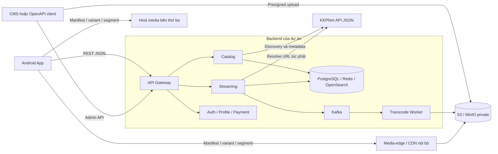

# Thiết kế chi tiết app xem phim trên Android

Bản đồng bộ: **2026-09-12 / revision 4**. Tài liệu mô tả sản phẩm và kiến trúc; tiến độ triển khai được ghi trong backend TODO. Phạm vi không bao gồm kiểm tra bản quyền nguồn bên thứ ba.

[Thiết kế backend chi tiết](backend-chi-tiet.md) là nguồn chuẩn của schema, API nội bộ và sự kiện. [Hợp đồng Payment OpenAPI](payment-openapi.yaml) mô tả route subscription/entitlement đã nghiệm thu. [Tài liệu tích hợp KKPhim](kkphim-api.md) mô tả endpoint/response từ provider. [TODO và prompt backend](todo-prompt-backend.md) là lộ trình thực hiện. Khi thay đổi hợp đồng dự án, cập nhật phần sản phẩm và TODO liên quan.

## 1. Phạm vi sản phẩm

App phục vụ đồng thời phim người quản trị upload và phim từ KKPhim. Người dùng duyệt một catalog chung, có thể tìm kiếm, xem chi tiết, chọn phim/tập/server, phát HLS, tiếp tục xem và lưu favorites. Nguồn là thuộc tính kỹ thuật để player hoạt động đúng; giao diện có thể hiển thị nhãn server/ngôn ngữ có ích, không cần hiển thị ID hoặc thông tin backend.

| Khả năng | MVP backend | Sau MVP |
|---|---|---|
| Tài khoản | Email/password, JWT, refresh rotation, logout, 5 thiết bị đăng nhập | OAuth, xác minh email/reset password trước mở đăng ký production |
| Profile | CRUD, tối đa 5 profile, favorites, lịch sử theo profile | Tùy chọn phụ đề/ngôn ngữ, PIN hồ sơ kids |
| Catalog | Movie/series, thể loại/quốc gia, metadata nội bộ và KKPhim, tìm kiếm catalog đã import | Khám phá nguồn rộng hơn, quản trị metadata nâng cao |
| Playback | HLS owned và third_party, ABR khi manifest hỗ trợ, resume, session/heartbeat | DASH, DRM, picture-in-picture và track selection hoàn chỉnh trên Android |
| Upload | CMS API → object storage → FFmpeg → HLS | Multipart/resumable upload dung lượng lớn |
| Gói cước | Free/subscription, payment mock có chữ ký, mua lại sau khi gói hết hạn | Provider thật, đổi gói/gia hạn tự động/refund |
| Notification/gợi ý | Mock delivery, trending và rule-based | FCM/email thật, cá nhân hóa nâng cao |
| Offline | Chưa có | Download nội bộ, cache/đồng bộ offline; nguồn ngoài vẫn streaming |
| Triển khai | Compose + CI, smoke staging theo cấu hình được cung cấp | Kubernetes/HPA/KEDA khi có số liệu tải |

Profile kids chỉ hiển thị/phát nội dung có `isKidsSafe=true`; metadata chưa phân loại mặc định false, không coi mọi phim hoạt hình là cho trẻ em. Đây là quy tắc sản phẩm áp dụng cả list và playback, không chỉ lọc trên UI.

Các mục tiêu phi chức năng gồm startup video thấp, progress bền vững, cô lập lỗi provider, định tuyến rõ, dữ liệu riêng từng người xem và khả năng vận hành. Không coi thiết kế là bằng chứng hệ thống đã chịu được tải thực tế.

## 2. Kiến trúc tổng thể



Backend trao đổi metadata, xác thực và trạng thái. Media3 nhận video trực tiếp từ host bên thứ ba hoặc CDN nội bộ; video không đi qua Gateway/Streaming API. Object storage là origin, CDN là lớp phân phối phía trước, không phải nơi CMS “upload vào CDN”.

### 2.1. Stack được chọn

| Backend | Lựa chọn |
|---|---|
| Ngôn ngữ/framework | Node.js 24.21.0 + NestJS 11.2.3/TypeScript 5.9.3, TypeORM 0.3.31 migrations |
| API | REST/JSON công khai và HTTP REST nội bộ có service auth |
| Dữ liệu | PostgreSQL 16.4, database riêng từng service; Redis 7.4.2 cache/lease, OpenSearch 2.19.1 dev |
| Sự kiện | Apache Kafka 4.2.0 KRaft, outbox/inbox, idempotency |
| Video | MinIO RELEASE.2025-06-13T11-33-47Z, FFmpeg, HLS, Nginx media-edge/CDN adapter |
| Dev/CI | Docker Compose profiles, GitHub Actions; Kubernetes sau MVP |
| Giám sát | Structured logs, Prometheus 3.2.1/Grafana 11.5.1/Loki 3.4.2 |

Dùng NestJS monorepo tại `Backend/`, gồm Gateway, Auth, Profile, Catalog, Payment, Streaming, Worker, Notification và Recommendation. Chia domain từ đầu; chỉ chạy các service cần thiết ở từng giai đoạn. Chi tiết workspace, pin version và deployment nằm trong tài liệu backend. Image single-node và credentials mẫu chỉ dành cho local/CI, không phải production.

### 2.2. Trách nhiệm các thành phần

| Thành phần | Trách nhiệm |
|---|---|
| Gateway | Public/Admin routes tường minh, auth/rate limit, requestId; compose Home personalized |
| Auth | User, auth session/thiết bị, JWT/JWKS, refresh rotation và revoke |
| Profile | Profile ownership, favorites; đọc history từ Streaming |
| Catalog | Canonical movie/playable/source mapping, import/sync, published/archive, search |
| Streaming | Phiên phát, lease/quota, resolver, video assets owned, tiến độ xem |
| Payment | Plan/subscription/payment, webhook idempotent, entitlement hiện tại |
| Worker | Job FFmpeg bền vững, retry, kết quả transcode theo generation |
| Notification | Consume event, mock hoặc channel thật ở giai đoạn sau |
| Recommendation | Qualified views/trending/gợi ý, có HTTP nội bộ để Gateway lấy kết quả |
| CMS | Client quản trị riêng; MVP thao tác qua OpenAPI/Admin API |

## 3. Mô hình dữ liệu và catalog

- `movies`: một tác phẩm chuẩn hóa, có type movie/series, contentKind, accessTier free/subscription, published/archive, kids flag.
- `seasons` và `playable_items`: phim lẻ có một playable đầy đủ; series có playable cho mỗi tập. Tập thiếu số vẫn có label/sortOrder. Không dùng `episodeId=null` làm khóa tiến độ.
- `content_sources`: một movie có nguồn owned, nguồn third_party hoặc cả hai; provider KKPhim có external ID/slug.
- `source_items`: nối từng playable với lựa chọn server/nguồn cụ thể. Hai server cùng tập chia sẻ playableId nhưng khác sourceItemId.
- `video_assets`: chỉ media upload nội bộ, liên kết sourceItemId; không có asset hay URL stream bền vững cho KKPhim.
- `watch_progress`: khóa `(profile_id, playable_id)`, lưu vị trí theo seq/session version; favorites theo `(profile_id,movie_id)`.
- Auth/Profile/Payment có DB riêng. Không join FK xuyên service và không chia sẻ entity ORM qua shared libs.

Public catalog đọc metadata đã import vào DB của hệ thống; public search dùng OpenSearch của catalog đó. CMS có discovery KKPhim và job import/sync. Không lấy một trang local trộn trực tiếp với một trang API ngoài rồi gọi đó là phân trang hợp nhất.

Import giữ UUID local ổn định theo ID provider, auto-publish metadata hợp lệ; archive biên tập không bị sync mở lại. Lock metadata không đóng băng link/tập/server. Các lần update phát event update, không lặp thông báo “phim mới”. Chi tiết mapping/refresh và recovery theo tài liệu backend mục 3.

## 4. Hợp đồng Android ↔ Backend

JSON/query dùng camelCase; response `{success,data,error,requestId}`. Danh sách trong data có `{items,page,pageSize,totalItems,totalPages}`. Các route dưới đây là nhóm chính; bảng đầy đủ và role/public matrix ở backend mục 4.

| Thao tác Android | API |
|---|---|
| Đăng ký/đăng nhập/refresh/logout | `/auth/register`, `/auth/login`, `/auth/refresh`, `/auth/logout` (POST) |
| Profile | GET/POST `/profiles`, PATCH/DELETE `/profiles/:profileId` |
| Public catalog | GET `/catalog/home`, `/catalog/movies`, `/catalog/movies/:movieId`, `/catalog/search` |
| Home cá nhân | GET `/home?profileId=...`, JWT + ownership |
| Favorites | GET `/profiles/:profileId/favorites`; PUT/DELETE `/profiles/:profileId/favorites/:movieId` |
| Lịch sử | GET `/profiles/:profileId/watch-history` |
| Gói cước | GET `/subscriptions/plans`, POST `/subscriptions/subscribe`, GET `/subscriptions/current` |
| Tạo phiên phát | POST `/streaming/playback-sessions`, JWT + Idempotency-Key |
| Gia hạn slot đang phát | POST `/streaming/playback-sessions/:sessionId/heartbeat` |
| Tiến độ | POST `/streaming/playback-sessions/:sessionId/progress` |
| Started/qualified/failed/stopped | POST `/streaming/playback-sessions/:sessionId/events` |
| Renew cookie media nội bộ | POST `/streaming/playback-sessions/:sessionId/media-auth` |

Body tạo phiên: `{movieId,playableId,sourceItemId,profileId}`. User lấy từ JWT, các ID phải cùng movie/profile ownership. Không gửi URL tùy ý lên backend. Public Catalog không chứa progress của profile; API protected không được cache chung giữa người dùng.

Catalog list/detail/search nhận profileId tùy chọn; khi đang dùng profile kids, Android luôn gửi profileId và JWT để backend kiểm tra ownership/lọc nội dung. Không có profileId là catalog public tổng quát; PIN ngăn chuyển hồ sơ thuộc phần sau. Import KKPhim có thể chỉ định movieId để thêm nguồn vào tác phẩm có sẵn, admin xác nhận mapping tập thay vì tự merge theo tên.

MVP nội dung free không cần gói trả phí; đăng nhập để tạo session. Subscription cần active và chưa hết hạn. Giới hạn 5 thiết bị đăng nhập khác giới hạn stream đồng thời; free mặc định 1 stream, subscriber theo snapshot gói.

### 4.1. Luồng phát bên thứ ba theo vai trò

1. **Frontend:** lấy detail nội bộ và chọn tập/server; POST tạo session với ID và JWT. **Backend:** xác thực profile/tài khoản, publication/kids/tier và reserve slot atomic. **Bên thứ ba:** chưa truyền video.
2. **Backend:** dùng selector Catalog để resolver gọi mới detail KKPhim, bỏ qua metadata cache có URL cũ. Kiểm tra HTTPS/host và match đúng tập/server. **KKPhim API:** trả thông tin và URL tham chiếu; media host có thể khác domain API.
3. **Backend:** trả sessionId, sourceType, protocol hls, playbackUrl, resumePositionSeconds, leaseExpiresAt, drm null, offlineSupported false. urlExpiresAt có thể null nếu không biết; không đồng nhất nó với lease ứng dụng.
4. **Frontend:** Media3 tải master/variant/segment trực tiếp host media; không gửi user JWT của app tới host này. **Host media:** trả bytes video/audio. **Backend:** không proxy video, không tạo asset nội bộ cho nguồn ngoài.
5. **Frontend:** gửi progress mỗi 10–15 giây, heartbeat mỗi 30 giây, final progress rồi stopped khi kết thúc. **Backend:** commit PostgreSQL trước ACK, cập nhật cache, TTL 90 giây thu hồi slot nếu app mất mạng/chết.
6. **Lỗi provider:** app nhận lỗi nguồn, có thể re-resolve một lần và resume. Embed-only trả lỗi không hỗ trợ ở MVP. 401/403 của CDN ngoài không phải tín hiệu tự refresh user token. Backend không hứa kiểm soát URL đã cấp hay cưỡng chế độ phân giải trên CDN ngoài.

Sequence diagram và quy tắc failure/idempotency chi tiết nằm trong backend mục 5.2.

### 4.2. Luồng upload/phát nội bộ

CMS tạo upload → nhận assetId/presigned PUT → PUT trực tiếp storage → báo upload-complete → backend xác nhận file/checksum và ghi event → worker FFmpeg → output đầy đủ → asset ready → app tạo playback session → tải HLS qua media-edge/CDN.

Mỗi master/variant/segment/subtitle nội bộ được bảo vệ bởi media-edge policy, origin private. Ký mỗi master URL mà để segment truy cập tự do là chưa đủ. Android nhận cookie/header có scope CDN qua mediaAuth và tự renew khi hết hạn qua API phiên. Không chuyển cookie này sang host ngoài. DRM và offline làm ở phần sau MVP.

Cookie nội bộ mặc định sống 15 phút và có thể còn hiệu lực sau khi phiên đóng; TTL slot 90 giây không thu hồi cookie ngay. App dừng phát khi heartbeat bị từ chối và renew trước expiry. Cơ chế thu hồi tức thời tại edge cần thiết kế bổ sung nếu triển khai yêu cầu đó.

## 5. Frontend Android

### 5.1. Stack và module

Kotlin, Jetpack Compose, Clean Architecture + MVVM; Hilt; Retrofit/OkHttp; Coroutines/Flow; Room; Coil; Media3. FCM/Analytics/Crashlytics tích hợp sau khi có cấu hình và backend channel thật.

```text
app/                      # Navigation, DI, entry point
core/
  core-ui/                # Theme/design system
  core-network/           # Backend REST, single-flight refresh
  core-database/          # Room
  core-player/            # Media3 + media HTTP client riêng
feature/
  feature-auth/
  feature-home/
  feature-detail/
  feature-player/
  feature-search/
  feature-profile/
  feature-subscription/
domain/                   # Model, use case, repository interface
data/                     # DTO mapper, repository implementation
```

Domain không phụ thuộc Android/framework; feature gọi use case, data implement repository. Phân biệt HTTP client backend và media để tránh rò bearer/cookie qua redirect ngoài. Danh sách domain CDN/redirect và URI con trong manifest cần được kiểm tra tại tầng media khi triển khai.

### 5.2. Màn hình và trạng thái

- Onboarding/Auth: token lifecycle, login error, refresh mất response có thể yêu cầu đăng nhập lại. Token lưu trong storage dựa trên Android Keystore; không trong log/plain preferences.
- Home: new releases, top rated, trending (qualified views 7 ngày), tiếp tục xem theo profile. Recommendation lỗi thì bỏ section/fallback, không chặn Home.
- Detail: title/ảnh/mô tả, seasons/playableItems/sourceItems, server/ngôn ngữ, nút play, favorite. Unavailable thông báo rõ; không lấy slug làm ID history.
- Player: buffering/error/playing/paused/ended; seek/resume, track/resolution theo manifest; không hứa ABR khi nguồn chỉ có một rendition.
- Search: keyword, genre/country/year, paging ổn định, chỉ dữ liệu đã nhập. Kids filter dùng backend, không chỉ ẩn ở UI.
- Profile: chuyển hồ sơ phải hủy request/cache cá nhân cũ; ownership/favorites/history do backend thực thi.
- Subscription: hiển thị trạng thái pending/active/expired; không coi redirect payment “thành công” là bằng chứng đã trả tiền. Đọc lại backend sau webhook.

### 5.3. Progress, cache và offline

Mỗi session có seq tăng; backend dùng session ordinal để tránh request cũ ghi đè mới. Tua lại có thể giảm position. Đổi source có độ dài khác cần xác nhận resume; tập khác phải có playableId khác.

Room/Coil cache metadata/ảnh để hiển thị nhanh theo stale-while-revalidate. Network timeout không retry mọi POST mù: tạo phiên/order dùng Idempotency-Key; stopped/event dùng eventId; progress dùng seq. Logout/chuyển profile xóa cache nhạy cảm tương ứng.

MVP không hứa download offline. Phần mở rộng cần thiết kế quota dung lượng, trạng thái download, lỗi/retry, xóa file, expiry media credential/license và quy tắc đồng bộ khi offline event cũ gặp online progress mới. Source third_party hiện chỉ phát trực tuyến; thêm offline là thay đổi riêng.

## 6. Lộ trình sản phẩm đồng bộ với TODO

| Mốc | Giai đoạn TODO | Kết quả |
|---|---|---|
| Nền tảng và danh tính | G0–G2 | Workspace/CI/Gateway/Auth/Profile dùng được |
| Catalog và thương mại | G3–G4 | Catalog hai nguồn, import ổn định, payment mock/entitlement |
| Xem phim | G5–G6 | Session/progress KKPhim + upload/transcode/phát owned hoàn chỉnh |
| Trải nghiệm dữ liệu | G7–G8 | Search tiếng Việt, personalized home/history, notification mock/gợi ý |
| Nghiệm thu và triển khai | G9–G10 | E2E/fault checks cho hai nguồn, staging/deployment theo cấu hình thực tế |
| Sau MVP | E1–E4 | Tài khoản/communication thật, payment thật, media nâng cao, vận hành scale |

Thiết kế backend chịu trách nhiệm API và dữ liệu Android cần; các prompt TODO không mặc định giao viết ứng dụng Android/CMS ở các giai đoạn backend. Mọi mục chưa triển khai/kiểm chứng tiếp tục để chưa hoàn thành.
